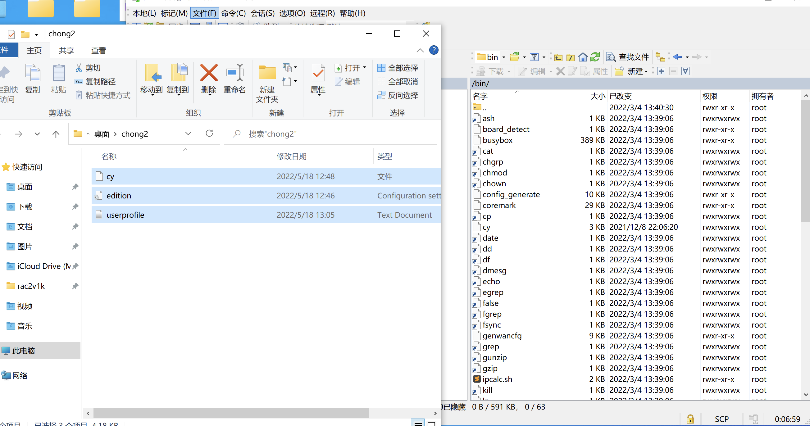
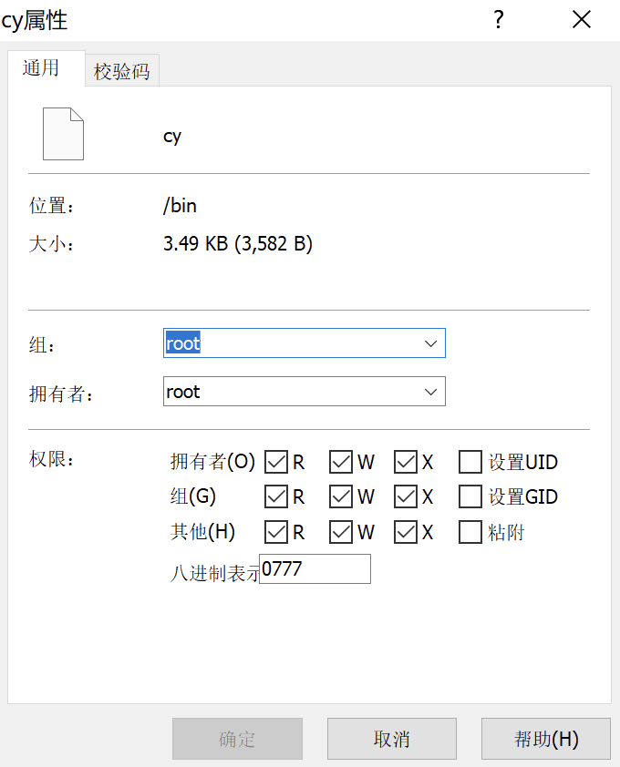

## 说明文档

用WinScp将feiyoung上传到 /etc/storage/ 文件夹


```
直接用WinSCP属性设置权限
```







如图，把帐号和31天密码填入userprofile.txt文件，并保存


在路由器的计划任里设置每半分钟启动一次脚本，如图


```
* * * * * /etc/storage/feiyoung/cy
* * * * * sleep 30; /etc/storage/feiyoung/cy
```
